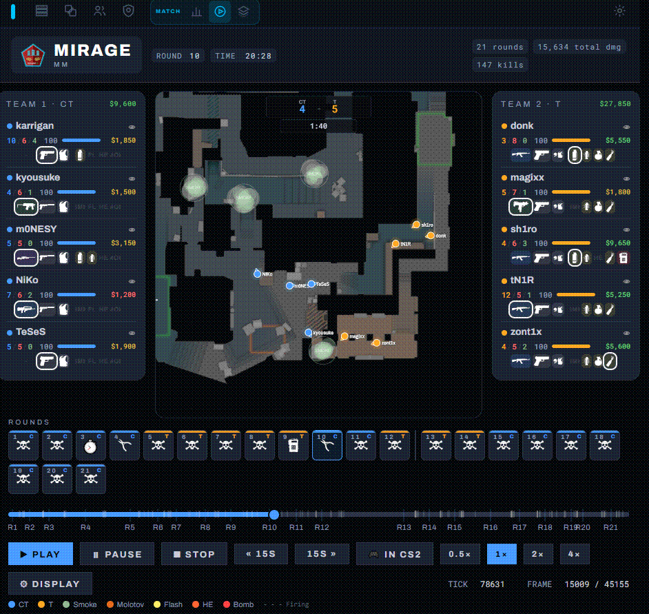
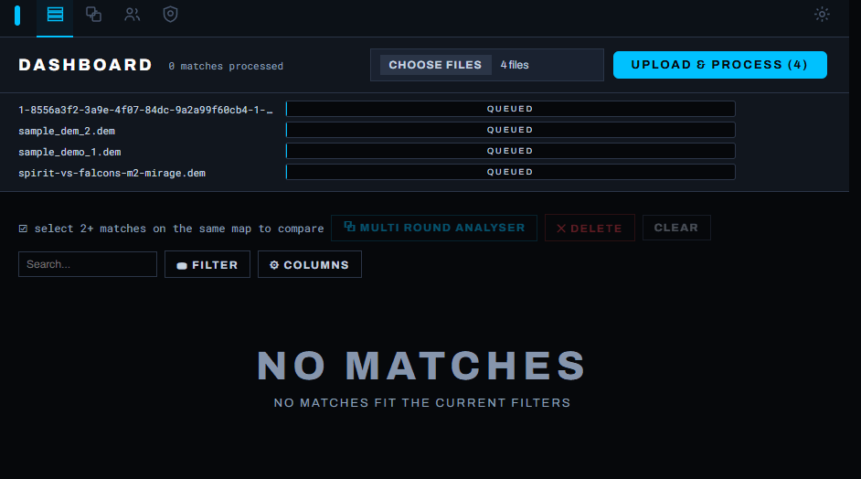

# Another CS2 Demo Viewer

**Rewatch your Counter-Strike 2 matches as a 2D replay, and get more out of every match.**

Drop in a `.dem` file and watch any round back on the map. You can scrub, zoom, follow a player and draw on it, with smokes, molotovs and flashes shown at their "real" in-game sizes.
Each match features automated highlights, a duel matrix, and a statistics page covering classic metrics like KDA, Rating, Multi-kills, and Flash assists. You also get player profiles alongside single- and multi-match analyzers. Finally, an experimental review layer compares aim and game sense against same-ranked players to highlight potential cheating.

**Everything runs on your own computer.**
Nothing is uploaded, you don't need an account, and it works offline. On Windows and Linux there's a download with everything included; otherwise it needs **Python**. Either way it needs **the map images** from your own copy of
CS2.

<p align="center">
  
</p>

---

- [Quick start](#quick-start): download a release and run it
- [Features](#features): what you can do with it
- [Map images](#map-images)
- [Optional extras](#optional-extras)
- [Troubleshooting](#troubleshooting)
- [Your data](#your-data)
- [Build it yourself / develop](#build-it-yourself--develop)
- [Credits, license, legal](#credits--licenses)

---

## Quick start

<!-- MAINTAINER: replace <RELEASES-URL> with the real releases page before publishing. -->

**Windows:** download **`CS2Viewer-Setup-<version>.exe`** from <RELEASES-URL> and run it.
There's nothing else to install, and the app opens in its own window. The installer isn't
code-signed, so Windows may say *"Windows protected your PC"*. If it does, click **More info
→ Run anyway**.

**Linux:** download **`CS2Viewer-<version>-linux-x64.tar.gz`**, extract it and run
`./CS2Viewer`. It opens in your browser. The terminal it runs in *is* the app, so closing
the terminal stops it. `./install-menu-entry.sh` adds it to your application menu.

Then add the map images (see [Map images](#map-images)) and drag a `.dem` onto the Matches
page. The optional CS2 features turn VAC off for that game session, so read
[About VAC](#optional-extras) before you use them.

<p align="center">
  
</p>

No release for your system? See [Build it yourself](#build-it-yourself--develop).

## Features

| Feature | What you can do |
|---|---|
| **2D replay** | Watch any round back on the map. Scrub, zoom, and click a player to follow them. Smokes, molotovs, flashes, grenade trails, dropped weapons and the bomb are all drawn, including plant and defuse progress. |
| **Match stats** | Full scoreboard with K/D, ADR, KAST and rating, plus opening kills, trades, multi-kills, clutches, utility damage and a head-to-head duel table. |
| **Automatic highlights** | Identifies Clutches, multi-kills and high-impact kills for you to watch. |
| **Match Analyser** | Stack rounds from several matches on one map and play them together, to see how the same site take plays out each time. Ask questions across all your matches, like *"AWP opening kills on B in rounds we lost"*. Get the answer as a list. |
| **Player profiles** | Everyone you've played with or against: maps won and lost, weapons, teammates, utility rating and a highlight reel. |
| **Overwatch review** *(experimental)* | Checks aim, consistency and game sense against players of the same rank, and lists the moments that stand out. *This is very experimental and not fleshed out by any means.* |
| **Open in CS2 / record clips** *(optional)* | Jump from any moment into the real demo in CS2, from that player's view, or record it as an in-game `.mp4`(*Windows-only*). See [Optional extras](#optional-extras). |

## Map images

The map images belong to Valve, so they can't ship with the app. They come from your own
CS2 install and go in **`static/assets/overheadmaps/`**, under the names CS2 uses:

```
static/assets/overheadmaps/de_mirage_radar_psd.png
static/assets/overheadmaps/de_nuke_lower_radar_psd.png   ← lower floor, for the Layer switch
```

A plain `de_mirage.png` works too. Each file must be **1024×1024**.

- **You have CS2 on this PC:** go to **Settings → UI Asset Extraction → Extract now**. It
  pulls the map images, plus rank, weapon and map icons, straight out of your game files.
  See [Game icons](#optional-extras) for what that needs.
- **No CS2 on this PC:** go to **Settings → Import Icons Manually** and upload the images,
  or a zip of a `static/assets` folder from a computer that has the game.

Calibrated maps: **Dust 2, Mirage, Inferno, Anubis, Ancient, Nuke, Vertigo, Overpass,
Cache, Train.**

## Optional extras

The app works fully without any of these. Each is set up on the **Settings** page, which
shows what it found and what's missing. Set the **CS2 game directory** there once (there's
an auto-detect button) and all three share it.

| Extra | What it adds | What it needs |
|---|---|---|
| **Game icons** | Real weapon, rank and map icons, plus the map images above | CS2 · [Source2Viewer-CLI](https://github.com/ValveResourceFormat/ValveResourceFormat/releases) (the `cli-…-x64.zip` download) |
| **Open in CS2** | 🎮 buttons that open the real demo at that moment, from that player's view | CS2 |
| **Clip recording** | 🎥 records real in-game video of a highlight to `.mp4` | CS2 · [HLAE](https://github.com/advancedfx/advancedfx) · [ffmpeg](https://ffmpeg.org/) |

> **⚠️ About VAC:** "Open in CS2" and clip recording both start the game with `-insecure`,
> which turns VAC off for that session. **Close CS2 and start it normally before playing an
> official match.** Watching your own demos this way can't get you banned. Clip recording
> also uses HLAE, which hooks into the game; "Open in CS2" injects nothing.

## Troubleshooting

- **`python` / `pip` is not recognized.** Python isn't on your PATH. Re-run the installer,
  choose **Modify**, tick **"Add Python to PATH"**, and then open a *new* terminal. On
  macOS/Linux, try `python3` / `pip3`.
- **The Windows app opened in your browser instead of its own window.** The Microsoft Edge
  WebView2 Runtime is missing. The installer normally adds it, and you can also install it
  from Microsoft. Until then the app works the same in the browser; closing the message box
  stops it. The log is at `%LOCALAPPDATA%\CS2Viewer\logs\app.log`.
- **The map is blank.** The image for that map is missing. See [Map images](#map-images).
- **Port 8000 is busy.** The app is already running in another window. Close that window,
  or start this one on another port: `$env:CS2VIEWER_PORT=8001; python serve.py`
  (PowerShell) or `CS2VIEWER_PORT=8001 python3 serve.py`.
- **Processing a demo fails.** The file is probably corrupt or only half-downloaded, so
  download it again. The Settings page shows whether the demo reader was found.
- **Something looks broken after an update.** Hard-refresh the page with
  <kbd>Ctrl</kbd>+<kbd>F5</kbd>.

## Your data

Everything is stored in one folder: your demos, the processed matches, any recorded clips
and the game icons. That folder is **`%LOCALAPPDATA%\CS2Viewer`** for the Windows app,
**`~/.local/share/cs2viewer`** for the Linux download, and the **`data`** folder next to the
app when you run it from source. To back up, copy that folder. To keep it on another drive,
set `CS2VIEWER_DATA_DIR` before starting the app. A processed match takes about 5 MB; the
original `.dem` files (200–400 MB each) are what fill a disk.

**Nothing leaves your computer.** The app makes no outbound connections; it only serves pages to your own browser.

**Updating:** for the Windows app, run the new installer and your matches are kept. For the
Linux download, extract the new version; your data stays where it is. From source, unzip the
new release, then copy your `data` and `static/assets` folders into it.

---

## Build it yourself / develop

To build from source, you also need **[Go](https://go.dev/dl/) 1.24+** (and Git).

```bash
git clone <REPOSITORY-URL> && cd <FOLDER>
./build.sh                      # build.bat on Windows: builds the demo reader into bin/
python -m venv .venv            # run.bat uses this venv
.venv/Scripts/activate          # macOS/Linux: source .venv/bin/activate
pip install -r requirements.txt
./run.sh                        # run.bat on Windows
```

**Desktop build** (the Windows installer or the Linux download). It needs a python.org
Python, because PyInstaller refuses the Microsoft Store one. The Windows installer also needs
[Inno Setup 6](https://jrsoftware.org/isinfo.php):

```bash
python -m venv .desktop-venv
.desktop-venv/Scripts/pip install -r requirements-desktop.txt   # .desktop-venv/bin/ on Linux
.desktop-venv/Scripts/python tools/build_desktop.py             # -> dist/
python desktop.py               # the app window straight from the checkout, no build
python serve.py --open          # the browser version, opening a tab for you
```

**How it fits together.** A Go binary (`cmd/parser`, built on
[demoinfocs-golang](https://github.com/markus-wa/demoinfocs-golang) v5) turns a `.dem`
into match JSON plus compact per-tick position chunks. A Flask app (`app.py`, served by
`serve.py`) does routing and analysis. The browser does all the rendering.

```
app.py  serve.py  paths.py  maps.py …   Python app (paths.py owns every on-disk location)
desktop.py  desktop.spec  installer/    the desktop window + its PyInstaller / Inno Setup build
analysis/                               highlights, moment/query engine, utility rating, Overwatch
cmd/parser/  cmd/overwatch/             Go demo parser + 2nd-pass extractor
static/  templates/                     frontend; static/*.logic.js are pure, unit-tested modules
tools/  test/                           asset pipeline, map calibration, smoke tests, test suites
bin/  data/  static/assets/             generated or local-only (gitignored)
```

**Tests**

```bash
node test/run_all.mjs            # all JS + Python suites (--js / --py / name filters)
go test ./cmd/...                # parser
python tools/smoke_pages.py      # real browser at 640/950/1920px (needs playwright)
./tools/linuxtest/linux_test.sh  # whole app on Ubuntu in Docker (--fast skips Go + Chromium)
```

**Known limitations**

- Cross-match player identity is by name, so a renamed player shows up twice. The Overwatch
  dashboard uses SteamID and doesn't have this problem.
- Match timestamps come from the demo file's modified date, because CS2 demos store no date.
- Overwatch analysis needs the original `.dem`, and its percentiles are weak until about 10
  matches have been analysed.
- The CS2 extras are Windows-only in practice (HLAE is Windows-only).
- A map with no calibration entry falls back to Dust 2's projection and draws in the wrong
  places.

---

## Credits & Licenses

### Credits

This project stands on the shoulders of giants. Special thanks to the following
open-source tools that made this possible:

*   **[demoinfocs-golang](https://github.com/markus-wa/demoinfocs-golang)**: parses demo files (MIT License).
*   **[Source2Viewer (ValveResourceFormat)](https://github.com/ValveResourceFormat/ValveResourceFormat)**: extracts UI assets from local game files (MIT License).
*   **[HLAE / advancedfx](https://github.com/advancedfx/advancedfx)**: in-game clip recording (MIT License).
*   **[CSGO Demo Manager](https://github.com/akiver/cs-demo-manager/)**: inspection concepts and tool inspiration (MIT License).

### License

This project is licensed under the MIT License; see the [LICENSE](LICENSE) file for details.

## Legal Disclaimer

This project is an independent, open-source fan creation and is **not** affiliated with,
authorized, maintained, sponsored, or endorsed by Valve Corporation.

Counter-Strike, Counter-Strike 2, CS2, Source, and the Source logo are trademarks or
registered trademarks of Valve Corporation in the U.S. and/or other countries. All game
assets, maps, and UI icons extracted from local game files remain the sole intellectual
property of Valve Corporation. This tool does not ship or redistribute any proprietary
game files or copyrighted data.
